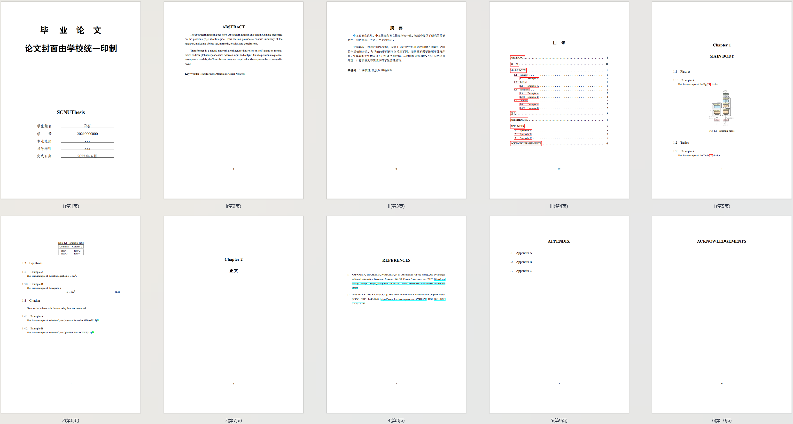

# NEXT-SCNUThesis

华南师范大学本科毕业论文 LaTeX 模板 [更新中]

  
动机 & 碎碎念

  起因是作者毕业论文需要将同一篇论文内容以两种不同的模板（华南师范大学和阿伯丁大学）分别提交，而阿伯丁提供了 LaTeX 模板，华南师范大学的模板则是 Word 的。而要将 1.5万词的英文论文（公式、引用、图表）从 LaTeX 模板迁移到 Word 模板，懂的都懂。更窒息的是，在华师的毕业论文要求中，不能完全不出现中文，而本专业又要求英文写作，这就导致必须在 LaTeX 模板中混排中文和英文。作者已经基本完成英文 LaTeX 模板下的毕业论文，鉴于此，一个能无痛迁移且符合华南师范大学本科毕业论文格式要求的 LaTeX 模板就成为刚需了。本项目部分细节参考了scnuthesis，从空白模板头尽可能简洁地手撕了这个项目。亲测从本人的英文 LaTeX 论文初步迁移到本模板耗时约 10 分钟，即可大致符合要求。至于是否最终符合还待今年作者毕业的检验。

## 👀 预览

## 特性

🔥 基本符合华南师范大学本科毕业论文格式要求
🔥 更好的中英混排
🔥 更高级别的封装
🔥 从英文模板无痛迁移

## 使用方法

📖 [Wiki - How To Use](https://github.com/FaterYU/NEXT-SCNUThesis/wiki/How-To-Use)

## TODO

- [x] 适配纯英文论文
- [x] GitHub Release 发布
- [ ] Overleaf 模板发布
- [ ] 适配纯中文论文
- [ ] GitHub CI

## 遇到问题❓

1. 检查 [Wiki - How To Use | 常见问题](https://github.com/FaterYU/NEXT-SCNUThesis/wiki/How-To-Use#%E5%B8%B8%E8%A7%81%E9%97%AE%E9%A2%98)
2. 检查 [ISSUE](https://github.com/FaterYU/NEXT-SCNUThesis/issues)
3. 提出 [ISSUE](https://github.com/FaterYU/NEXT-SCNUThesis/issues) or 联系作者

## 参考

🔗 [scnuthesis](https://github.com/scnu/scnuthesis)
🔗 [University of Aberdeen thesis template](https://www.overleaf.com/latex/templates/university-of-aberdeen-thesis-template/jzrbyqmggygd)
🔗 [SCNU-ABD-Thesis-template](https://github.com/kikixiong/SCNU-ABD-Thesis-template)
